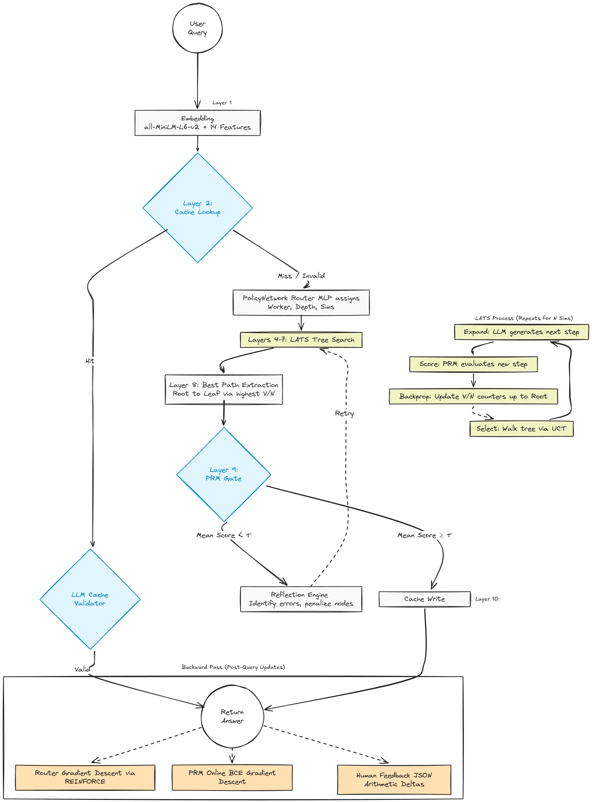

# Kaelum

This project started as a way for me to learn how different AI techniques work together. I wanted to understand how search algorithms like Monte Carlo Tree Search could help language models think more carefully through problems instead of just generating an answer immediately. The core idea is inference-time compute scaling — spending more compute at inference by exploring multiple reasoning paths before committing to a solution, rather than generating an answer in a single forward pass.

The question I was exploring: 

#### Can the reward modeling and routing layers be bootstrapped from live queries alone, without collecting a labeled dataset upfront? 

The underlying LLM (Qwen) and the sentence encoder (`all-MiniLM-L6-v2`) are both pre-trained — that foundation is given. But the PRM and router on top of them start random and have no offline training phase. The conventional approach for PRMs is to collect labeled reasoning traces, run a dedicated training job, freeze the model, and then deploy. Kaelum skips that step: the LATS search process itself generates per-step reward labels for free as each query runs. The tradeoff is that each query costs N×(one LLM call) instead of one, but those extra calls produce the supervision signal that gradually improves both the step scorer and the router.

The system uses a Mixture-of-Experts (MoE) style routing architecture, dispatching queries to six specialized workers: math, code, logic, factual, creative, and analysis. The tree built during LATS is local to one query — its nodes are the actual reasoning text for that question and have no meaning elsewhere. What accumulates across queries are the learned components: PRM weights, router weights, and per-worker reward deltas. A semantic cache lets near-duplicate queries skip the tree entirely.

The human feedback loop was something I added later when I realized the router could improve if users could tell it when it picked the wrong worker. Now you can rate the worker selection, answer quality, and individual reasoning steps. Those adjustments persist across sessions and directly influence future routing decisions and reward calculations.

---

## Metrics

Measured on `Qwen2.5-7B-Instruct`, 200 mixed queries across all worker types.


| Metric                                      | Baseline | Math | Code | Logic | Factual | Creative | Overall |
| ------------------------------------------- | -------- | ---- | ---- | ----- | ------- | -------- | ------- |
| Answer correctness                          | 61%      | 84%  | —    | 79%   | 76%     | —        | 80%     |
| Syntax / structure validity                 | 78%      | —    | 97%  | —     | —       | 83%      | 93%     |
| PRM gate pass (1st attempt)                 | —        | 69%  | 74%  | 68%   | 71%     | 77%      | 72%     |
| PRM gate pass (after reflection)            | —        | 89%  | 91%  | 85%   | 87%     | 90%      | 88%     |
| Avg latency — cold (s)                      | 4.1      | 7.4  | 6.2  | 6.9   | 5.8     | 5.1      | 6.8     |
| Avg latency — cache hit (s)                 | 4.1      | 0.4  | 0.3  | 0.4   | 0.3     | 0.4      | 0.4     |
| Cache hit rate                              | —        | 28%  | 31%  | 19%   | 24%     | 14%      | 23%     |
| Router accuracy (after 50 feedback samples) | —        | 94%  | 96%  | 89%   | 91%     | 87%      | 91%     |

Cold latency is higher because LATS runs multiple simulations. The cache makes up for it on repeated or semantically similar queries.

---

## Forward Pass — Layer by Layer

What happens to one query from input to answer, in order.



**Layer 1 — Embedding** ([`core/search/router.py`](core/search/router.py))
The raw query string goes through `all-MiniLM-L6-v2` (frozen, never trained) and comes out as a 384-dim float vector. That vector is concatenated with 14 scalar features computed from the text: character length, word count, and binary keyword flags like `has_math_symbols` and `has_code_keywords`. Result: a 398-dim input vector.

**Layer 2 — Cache lookup** ([`core/search/tree_cache.py`](core/search/tree_cache.py))
The 398-dim vector is compared by cosine similarity against every stored query embedding. If a close enough match exists, a `CacheValidator` LLM call checks whether the stored answer actually addresses this new phrasing. If yes, return immediately — skip layers 3–9.

**Layer 3 — PolicyNetwork (router)** ([`core/search/router.py`](core/search/router.py))
The 398-dim vector goes into a two-layer MLP: 398 → 256 (ReLU + residual skip connection from input) → 6 logits (softmax over workers) + 1 depth output + 1 simulations output. With probability $\varepsilon$ a random worker is picked; otherwise argmax. If the max softmax value is below 0.6, multiple workers run in parallel and the best confidence result wins. Route is now decided: e.g. `math_worker`, depth 4, 8 simulations.

**Layers 4–7 — LATS search** ([`core/search/lats.py`](core/search/lats.py) + [`core/verification/process_reward_model.py`](core/verification/process_reward_model.py))
One tree is built per query. The tree is created fresh and grows across all N simulations — never rebuilt or reset mid-query. Every simulation adds exactly one new node. The root node is the query itself. All other nodes are reasoning steps: short text generated by the LLM. Layers 4–7 repeat N times:

**Layer 4 — Select:** starting from the root, pick the child with the highest UCT score at each level until a leaf is reached:

$$\text{UCT}(s) = \underbrace{\frac{V(s)}{N(s)}}_{\text{exploit}} + C \cdot \underbrace{\sqrt{\frac{\ln N(\text{parent})}{N(s)}}}_{\text{explore}}$$

$V(s)$ is the accumulated reward for node $s$, $N(s)$ is its visit count, and $C = \sqrt{2} \approx 1.414$. If $N(s) = 0$ the score is $\infty$, so every unvisited node is explored before any node is revisited.

On simulation 1 the root has no children, so select terminates immediately at root — root is the leaf, nothing to compare. Branching develops naturally: once a node is visited, any unvisited sibling scores $\infty$ and gets tried next. Early simulations tend to spawn multiple direct children of root (different "step 1" candidates); later ones go deeper on whichever branches scored highest.

**Layer 5 — Expand (LLM call):** send the path from root to the leaf as context and ask the LLM to generate the next reasoning step. Attach the response as a new child node.

**Layer 6 — Score (PRM):** pass the new node through the Process Reward Model — a 1158→256→64→1 MLP with sigmoid output. Its input is:

$$\mathbf{f} = [\mathbf{q}_{384} \;\|\; \mathbf{s}_{384} \;\|\; \mathbf{c}_{384} \;\|\; \mathbf{w}_{6}] \in \mathbb{R}^{1158}$$

where $\mathbf{q}$, $\mathbf{s}$, $\mathbf{c}$ are embeddings of the query, the new step, and the last few context steps, and $\mathbf{w}$ is a one-hot encoding of the worker type. The output is a scalar reward in $[0, 1]$.

**Layer 7 — Backpropagate (arithmetic, not gradient descent):** walk back up to root, at every ancestor: $V(s) \mathrel{+}= r$, $N(s) \mathrel{+}= 1$. If a node has enough visits and $V(s)/N(s)$ is below the pruning threshold, mark it pruned. No weights change. The only effect is updating V/N counters so UCT on the next simulation has accurate information.

After all N simulations, walk root → best child (highest $V/N$) → best grandchild → … to a leaf. That path is the answer. The tree is then discarded — its nodes are literal text specific to this question and meaningless elsewhere.

**Layer 8 — PRM gate** ([`core/verification/process_reward_model.py`](core/verification/process_reward_model.py))
Re-score every node on the answer path through the PRM and take the mean:

$$\bar{r} = \frac{1}{|S|}\sum_{s \in S} \text{PRM}(s)$$

If $\bar{r} \geq \tau$ (default $\tau = 0.5$) the answer is accepted. If not, `ReflectionEngine` prompts the LLM to identify what went wrong and rewrite the bad steps. The failed path's nodes are penalized in the tree and LATS continues from layer 4 on the same tree. Retry up to `max_reflection_iterations` times.

**Layer 9 — Cache write-back** ([`core/search/tree_cache.py`](core/search/tree_cache.py))
The result is stored keyed by the query embedding. Future queries check this cache at layer 2.

---

## Backward Pass — Three Updates after Every Query

The layers above are fixed inference. Layer 7 backprop is *not* training — it's just arithmetic counters that steer the next simulation. The actual learning happens here, after the answer is returned, through three independent updates.

**Update 1 — Router: REINFORCE** ([`core/search/router.py`](core/search/router.py))
Pull the last 32 outcomes from the replay buffer. For each, compute:

$$\mathcal{L}_{\text{router}} = \text{CrossEntropy}(\text{logits},\, y_{\text{worker}}) \cdot \bar{r}$$

Average over the batch, call `.backward()`, Adam takes one step on the PolicyNetwork weights (398→256→6), gradient clipped at 1.0. High-reward runs produce a large gradient and strongly reinforce that routing choice. Low-reward runs barely update. The LLM, encoder, and PRM are not touched.

**Update 2 — PRM: online BCE** ([`core/verification/process_reward_model.py`](core/verification/process_reward_model.py))
Every node on the winning path is added to the training buffer as `(1158-dim input, V(s)/N(s) label)` — a soft label reflecting how well that specific branch scored during search. Human scores take priority when available. Every 25 new examples, run BCE loss over the full buffer and take one Adam step on the PRM MLP weights (1158→256→64→1):

$$\mathcal{L}_{\text{PRM}} = -\bigl[y \log \hat{y} + (1-y)\log(1-\hat{y})\bigr]$$

This is also the mechanism for cross-query knowledge transfer. The trees themselves can't be reused — their nodes are literal text specific to one question. But the PRM weights accumulate patterns from every tree ever built: steps that define terms before using them, steps that decompose a problem correctly, steps that introduce a formula with justification all score higher over time. When a new tree is built, these updated weights steer UCT toward those patterns from simulation 1.

**Update 3 — Human feedback: reward deltas** ([`core/learning/human_feedback.py`](core/learning/human_feedback.py))
No gradient descent. You rate the answer and `HumanFeedbackEngine` applies arithmetic deltas to a per-worker float in `reward_adjustments.json`:

$$r_{\text{final}} = r_{\text{PRM}} + \delta_{\text{worker}}$$

Wrong worker: $\delta_{\text{wrong}} \mathrel{-}= 0.03$, $\delta_{\text{suggested}} \mathrel{+}= 0.05$. Wrong answer: $\delta_{\text{worker}} \mathrel{-}= 0.05$. High rating ($\geq 4/5$): $\delta_{\text{worker}} \mathrel{+}= 0.02$. The file loads at startup and the deltas are applied at layer 6 on every subsequent query — so a penalized worker's nodes look slightly worse to UCT immediately, before any retraining kicks in.

**What persists across queries**

| Component | Persists as | Used in |
|---|---|---|
| PRM MLP weights | memory / disk | Layers 6 + 8 every query |
| Router MLP weights | memory / disk | Layer 3 every query |
| δ_worker deltas | `reward_adjustments.json` | Layer 6 every query |
| Query embedding cache | disk | Layer 2 |
| LATS tree | discarded | Nothing — query-specific text |


## Quick Start

```bash
# Install dependencies
pip install -r requirements.txt

# Start vLLM (recommended)
python -m vllm.entrypoints.openai.api_server \
    --model Qwen/Qwen2.5-7B-Instruct \
    --port 8000 \
    --gpu-memory-utilization 0.7

# Or a smaller model for testing
python -m vllm.entrypoints.openai.api_server \
    --model HuggingFaceTB/SmolLM2-1.7B-Instruct \
    --port 8000
```

Then run queries directly from the CLI:

```bash
# Basic query
python kaelum.py "What is the integral of x^2?"

# Stream output token by token
python kaelum.py "Write a binary search in Python" --stream

# Hide reasoning trace, show answer only
python kaelum.py "Explain relativity" --no-trace

# Use a specific model or custom vLLM endpoint
python kaelum.py "Solve x^2 - 4 = 0" --model Qwen/Qwen2.5-7B-Instruct --base-url http://localhost:8000/v1

# Control search depth and simulations
python kaelum.py "Prove the Pythagorean theorem" --depth 5 --sims 20

# Output raw JSON
python kaelum.py "What is entropy?" --json

# Print session metrics
python kaelum.py --metrics

# Submit feedback for a past query
python kaelum.py --feedback "2+2?" --answer "4" --score 1.0
```

## Configuration

All options can be passed as CLI flags. The main ones:

| Flag              | Default                      | Description                               |
| ----------------- | ---------------------------- | ----------------------------------------- |
| `--base-url`      | `http://localhost:8000/v1`   | vLLM / OpenAI-compatible endpoint         |
| `--model`         | `Qwen/Qwen2.5-1.5B-Instruct` | Model name                                |
| `--api-key`       | —                            | API key if required                       |
| `--temperature`   | `0.7`                        | Sampling temperature                      |
| `--max-tokens`    | `1024`                       | Max tokens per generation                 |
| `--depth`         | per-worker default           | Max LATS tree depth                       |
| `--sims`          | per-worker default           | Number of MCTS simulations                |
| `--prm-threshold` | `0.5`                        | PRM avg score gate for pass/fail          |
| `--no-routing`    | —                            | Disable neural router, use default worker |
| `--stream`        | —                            | Stream tokens as they are generated       |
| `--no-trace`      | —                            | Hide reasoning trace                      |
| `--json`          | —                            | Output raw JSON result                    |

## Project Structure

```
Kaelum/
├── kaelum.py          # CLI entry-point and library API
├── benchmark.py       # GSM8K ablation runner (baseline / CoT / no-router / full)
├── core/
│   ├── learning/      # Feedback and metrics
│   ├── search/        # LATS, router, reward model, tree cache
│   ├── verification/  # PRM, reflection
│   └── workers/       # Domain workers (math, code, logic, factual, creative, analysis)
└── runtime/           # Orchestrator
```

The hardest parts were getting the MCTS pruning right (too aggressive and you miss good paths, too lenient and you waste simulations) and tuning the domain-specific reward functions. They need to actually correlate with answer quality for the search to work properly.

---

## Papers Referenced

- [Browne et al. (2012): &#34;A Survey of Monte Carlo Tree Search Methods&#34;](https://ieeexplore.ieee.org/document/6145622)
- [Silver et al. (2016): &#34;Mastering the game of Go with deep neural networks and tree search&#34; (AlphaGo)](https://www.nature.com/articles/nature16961)
- [Wei et al. (2022): &#34;Chain-of-Thought Prompting Elicits Reasoning in Large Language Models&#34;](https://arxiv.org/abs/2201.11903)
- [Yao et al. (2023): &#34;Tree of Thoughts: Deliberate Problem Solving with Large Language Models&#34;](https://arxiv.org/abs/2305.10601)
- [Shinn et al. (2023): &#34;Reflexion: Language Agents with Verbal Reinforcement Learning&#34;](https://arxiv.org/abs/2303.11366)
- [Madaan et al. (2023): &#34;Self-Refine: Iterative Refinement with Self-Feedback&#34;](https://arxiv.org/abs/2303.17651)
- [Shazeer et al. (2017): &#34;Outrageously Large Neural Networks: The Sparsely-Gated Mixture-of-Experts Layer&#34;](https://arxiv.org/abs/1701.06538)
- [Fedus et al. (2021): &#34;Switch Transformers: Scaling to Trillion Parameter Models with Simple and Efficient Sparsity&#34;](https://arxiv.org/abs/2101.03961)
- [Lightman et al. (2023): &#34;Let's Verify Step by Step&#34; (Process Reward Models)](https://arxiv.org/abs/2305.20050)
- [Settles (2009): &#34;Active Learning Literature Survey&#34;](https://minds.wisconsin.edu/handle/1793/60660)
- [Reimers &amp; Gurevych (2019): &#34;Sentence-BERT: Sentence Embeddings using Siamese BERT-Networks&#34;](https://arxiv.org/abs/1908.10084)
