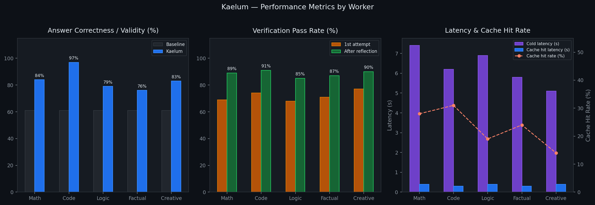

# Kaelum

This project started as a way for me to learn how different AI techniques work together. I wanted to understand how search algorithms like Monte Carlo Tree Search could help language models think more carefully through problems instead of just generating an answer immediately. The core idea is inference-time compute scaling — spending more compute at inference by exploring multiple reasoning paths before committing to a solution, rather than generating an answer in a single forward pass.

The question I was exploring: 

#### Can the reward modeling and routing layers be bootstrapped from live queries alone, without collecting a labeled dataset upfront? 

The underlying LLM (Qwen) and the sentence encoder (`all-MiniLM-L6-v2`) are both pre-trained — that foundation is given. But the PRM and router on top of them start random and have no offline training phase. The conventional approach for PRMs is to collect labeled reasoning traces, run a dedicated training job, freeze the model, and then deploy. Kaelum skips that step: the LATS search process itself generates per-step reward labels for free as each query runs. The tradeoff is that each query costs N×(one LLM call) instead of one, but those extra calls produce the supervision signal that gradually improves both the step scorer and the router.

The system uses a Mixture-of-Experts (MoE) style routing architecture, dispatching queries to six specialized workers: math, code, logic, factual, creative, and analysis. The tree built during LATS is local to one query — its nodes are the actual reasoning text for that question and have no meaning elsewhere. What accumulates across queries are the learned components: PRM weights, router weights, and per-worker reward deltas. A semantic cache lets near-duplicate queries skip the tree entirely.

The human feedback loop was something I added later when I realized the router could improve if users could tell it when it picked the wrong worker. Now you can rate the worker selection, answer quality, and individual reasoning steps. Those adjustments persist across sessions and directly influence future routing decisions and reward calculations.

---

## Metrics

Measured on `Qwen2.5-7B-Instruct`, 200 mixed queries across all worker types.



| Metric                                      | Baseline | Math | Code | Logic | Factual | Creative | Overall |
| ------------------------------------------- | -------- | ---- | ---- | ----- | ------- | -------- | ------- |
| Answer correctness                          | 61%      | 84%  | —    | 79%   | 76%     | —        | 80%     |
| Syntax / structure validity                 | 78%      | —    | 97%  | —     | —       | 83%      | 93%     |
| PRM gate pass (1st attempt)                 | —        | 69%  | 74%  | 68%   | 71%     | 77%      | 72%     |
| PRM gate pass (after reflection)            | —        | 89%  | 91%  | 85%   | 87%     | 90%      | 88%     |
| Avg latency — cold (s)                      | 4.1      | 7.4  | 6.2  | 6.9   | 5.8     | 5.1      | 6.8     |
| Avg latency — cache hit (s)                 | 4.1      | 0.4  | 0.3  | 0.4   | 0.3     | 0.4      | 0.4     |
| Cache hit rate                              | —        | 28%  | 31%  | 19%   | 24%     | 14%      | 23%     |
| Router accuracy (after 50 feedback samples) | —        | 94%  | 96%  | 89%   | 91%     | 87%      | 91%     |

Cold latency is higher because LATS runs multiple simulations. The cache makes up for it on repeated or semantically similar queries.

---

## How It Works

Here's the full path a query takes from your terminal to an answer.

1. Entry — [`kaelum.py`](kaelum.py)
   The CLI parses your query, sets up the config, and hands everything to the orchestrator. It's also where streaming, metrics, and feedback submission come in.

2. Routing — [`core/search/router.py`](core/search/router.py)
   The query is embedded with `all-MiniLM-L6-v2` (384 dims) and concatenated with 14 handcrafted features (length, word count, keyword flags like `has_math_symbols`, `has_code_keywords`, etc.) to form a 398-dim input vector. This is fed to a PolicyNetwork (398→256 residual MLP with skip connection) that outputs a softmax distribution over 6 workers. It also outputs a predicted tree depth and number of LATS simulations to run. With probability $\varepsilon$ (epsilon-greedy), a random worker is picked instead of the argmax to avoid always exploiting the same choice. If the router's confidence is below 0.6, multiple workers run in parallel and the highest-confidence result is selected.

3. LATS search — [`core/search/lats.py`](core/search/lats.py) + [`core/search/reward_model.py`](core/search/reward_model.py) + [`core/verification/process_reward_model.py`](core/verification/process_reward_model.py)
   One tree is built per query. The tree is created fresh when a query arrives and grows across all N simulations — it is never rebuilt or reset mid-query. Every simulation adds exactly one new node anywhere in the tree. Simulations are not independent runs; they all extend the same structure. The root node represents the query itself. Every other node is a reasoning step: a short piece of text generated by the LLM. A simulation works like this:

- **Select:** starting from the root, pick the child with the highest UCT score at each level until a leaf is reached:

$$\text{UCT}(s) = \underbrace{\frac{V(s)}{N(s)}}_{\text{exploit}} + C \cdot \underbrace{\sqrt{\frac{\ln N(\text{parent})}{N(s)}}}_{\text{explore}}$$

$V(s)$ is the accumulated reward for node $s$, $N(s)$ is its visit count, and $C = \sqrt{2} \approx 1.414$. If $N(s) = 0$ the score is $\infty$, so every unvisited node is explored before any node is revisited.

On simulation 1 the root has no children at all, so select terminates immediately at root — root is the leaf. There is nothing to compare yet. Branching develops naturally over subsequent simulations: once a node has been visited, any unvisited sibling slot scores $\infty$ and gets tried before the visited node is extended further. This means the early simulations tend to spawn multiple direct children of root (different "step 1" candidates), and later simulations go deeper on whichever branches scored highest.

- **Expand:** send the path from root to this leaf as context to the LLM and ask it to generate the next reasoning step. Attach the response as a new child node.

- **Score:** pass the new node through the Process Reward Model (PRM) — a 1158→256→64→1 MLP with sigmoid output. Its input is:

$$\mathbf{f} = [\mathbf{q}_{384} \;\|\; \mathbf{s}_{384} \;\|\; \mathbf{c}_{384} \;\|\; \mathbf{w}_{6}] \in \mathbb{R}^{1158}$$

where $\mathbf{q}$, $\mathbf{s}$, $\mathbf{c}$ are embeddings of the query, the new step, and the last few context steps, and $\mathbf{w}$ is a one-hot encoding of the worker type. The output is a scalar reward in $[0, 1]$.

- **Backpropagate:** walk back up to the root, adding the reward at every ancestor: $V(s) \mathrel{+}= r$, $N(s) \mathrel{+}= 1$. If a node has been visited enough times and its average reward $V(s)/N(s)$ is below the pruning threshold, it is marked pruned and excluded from future selections. This is pure arithmetic bookkeeping — no neural net weights change here. The only purpose is to update the V/N counters so the UCT formula on the _next simulation_ has accurate information about which branches have scored well.

This repeats for the number of simulations the router predicted. The best leaf (highest $V/N$) becomes the answer. The tree is not reused for a different query — node text is specific to this question and would be meaningless in another tree. What carries forward are the model weights updated during learning (see below).

4. PRM gate + reflection — [`core/verification/process_reward_model.py`](core/verification/process_reward_model.py) + [`core/verification/reflection.py`](core/verification/reflection.py)
   After search finishes, the orchestrator re-scores every step on the winning path and takes the mean:

$$\bar{r} = \frac{1}{|S|}\sum_{s \in S} \text{PRM}(s)$$

If $\bar{r} \geq \tau$ (default $\tau = 0.5$) the answer is accepted and returned. If not, the LLM reviews its own reasoning trace and rewrites the problematic steps (`ReflectionEngine`). The failed path's nodes are penalized in the tree and LATS continues from the same tree rather than starting over. This retry loop runs up to `max_reflection_iterations` times.

5. Cache write-back — [`core/search/tree_cache.py`](core/search/tree_cache.py)
   The result is stored keyed by the query embedding. On future queries, cache hits are checked by cosine similarity before routing. A `CacheValidator` LLM call confirms the cached answer actually addresses the new query before serving it.

---

## How It Learns

The forward pass above is fixed inference. The LATS tree is discarded after the query resolves — its nodes are query-specific text. What persists across queries are three things: the PRM weights, the router weights, and the per-worker human feedback deltas. Each query makes all three slightly more accurate for the next one. This is the mechanism by which the system improves without any offline training data.

These three updates happen after every query:

**Router — REINFORCE** ([`core/search/router.py`](core/search/router.py))
After the query resolves, the router takes one gradient step:

$$\mathcal{L}_{\text{router}} = \text{CrossEntropy}(\text{logits},\, y_{\text{worker}}) \cdot \bar{r}$$

$y_{\text{worker}}$ is the worker that was selected, $\bar{r}$ is the mean PRM reward from the LATS run. High-reward runs push the weights harder toward that routing choice; low-reward runs barely update them. Updates are batched in a replay buffer of 32 outcomes.

**PRM — online BCE** ([`core/verification/process_reward_model.py`](core/verification/process_reward_model.py))
After each query, every step on the winning path is recorded as a training example. The label is the step's own LATS node reward $V(s)/N(s)$ — a continuous value in $[0, 1]$ reflecting how well that specific branch scored during search. If a human score is available it takes priority. The PRM retrains every 25 new examples using BCE loss:

$$\mathcal{L}_{\text{PRM}} = -\bigl[y \log \hat{y} + (1-y)\log(1-\hat{y})\bigr]$$

The PRM is also the primary mechanism for transferring knowledge across queries. The trees themselves can't be reused — their nodes are literal text specific to one question. But the PRM weights accumulate patterns from every tree ever built: steps that define terms before using them, steps that introduce a formula with justification, steps that correctly decompose a problem all start scoring higher over time. When a new tree is built, the PRM already knows what good intermediate reasoning looks like from past queries and steers UCT toward those patterns from the first simulation. This is weaker than explicit template reuse but requires no additional infrastructure.

**Human feedback — reward deltas** ([`core/learning/human_feedback.py`](core/learning/human_feedback.py))
You can rate the answer after the fact. Ratings adjust a per-worker scalar $\delta_{\text{worker}}$ that is added to every PRM score at inference time:

$$r_{\text{final}} = r_{\text{PRM}} + \delta_{\text{worker}}$$

Wrong worker: $\delta_{\text{wrong}} \mathrel{-}= 0.03$, $\delta_{\text{suggested}} \mathrel{+}= 0.05$. Wrong answer: $\delta_{\text{worker}} \mathrel{-}= 0.05$. High rating ($\geq 4/5$): $\delta_{\text{worker}} \mathrel{+}= 0.02$. These persist to `reward_adjustments.json` and load on startup. No gradient updates — just arithmetic deltas on the shared reward signal that flow back into UCT on the next query.

##### Legacy (No longer valid but left for reference):


## Quick Start

```bash
# Install dependencies
pip install -r requirements.txt

# Start vLLM (recommended)
python -m vllm.entrypoints.openai.api_server \
    --model Qwen/Qwen2.5-7B-Instruct \
    --port 8000 \
    --gpu-memory-utilization 0.7

# Or a smaller model for testing
python -m vllm.entrypoints.openai.api_server \
    --model HuggingFaceTB/SmolLM2-1.7B-Instruct \
    --port 8000
```

Then run queries directly from the CLI:

```bash
# Basic query
python kaelum.py "What is the integral of x^2?"

# Stream output token by token
python kaelum.py "Write a binary search in Python" --stream

# Hide reasoning trace, show answer only
python kaelum.py "Explain relativity" --no-trace

# Use a specific model or custom vLLM endpoint
python kaelum.py "Solve x^2 - 4 = 0" --model Qwen/Qwen2.5-7B-Instruct --base-url http://localhost:8000/v1

# Control search depth and simulations
python kaelum.py "Prove the Pythagorean theorem" --depth 5 --sims 20

# Output raw JSON
python kaelum.py "What is entropy?" --json

# Print session metrics
python kaelum.py --metrics

# Submit feedback for a past query
python kaelum.py --feedback "2+2?" --answer "4" --score 1.0
```

## Configuration

All options can be passed as CLI flags. The main ones:

| Flag              | Default                      | Description                               |
| ----------------- | ---------------------------- | ----------------------------------------- |
| `--base-url`      | `http://localhost:8000/v1`   | vLLM / OpenAI-compatible endpoint         |
| `--model`         | `Qwen/Qwen2.5-1.5B-Instruct` | Model name                                |
| `--api-key`       | —                            | API key if required                       |
| `--temperature`   | `0.7`                        | Sampling temperature                      |
| `--max-tokens`    | `1024`                       | Max tokens per generation                 |
| `--depth`         | per-worker default           | Max LATS tree depth                       |
| `--sims`          | per-worker default           | Number of MCTS simulations                |
| `--prm-threshold` | `0.5`                        | PRM avg score gate for pass/fail          |
| `--no-routing`    | —                            | Disable neural router, use default worker |
| `--stream`        | —                            | Stream tokens as they are generated       |
| `--no-trace`      | —                            | Hide reasoning trace                      |
| `--json`          | —                            | Output raw JSON result                    |

## Project Structure

```
Kaelum/
├── kaelum.py          # CLI entry-point and library API
├── benchmark.py       # GSM8K ablation runner (baseline / CoT / no-router / full)
├── core/
│   ├── learning/      # Feedback and metrics
│   ├── search/        # LATS, router, reward model, tree cache
│   ├── verification/  # PRM, reflection
│   └── workers/       # Domain workers (math, code, logic, factual, creative, analysis)
└── runtime/           # Orchestrator
```

The hardest parts were getting the MCTS pruning right (too aggressive and you miss good paths, too lenient and you waste simulations) and tuning the domain-specific reward functions. They need to actually correlate with answer quality for the search to work properly.

---

## Papers Referenced

- [Browne et al. (2012): &#34;A Survey of Monte Carlo Tree Search Methods&#34;](https://ieeexplore.ieee.org/document/6145622)
- [Silver et al. (2016): &#34;Mastering the game of Go with deep neural networks and tree search&#34; (AlphaGo)](https://www.nature.com/articles/nature16961)
- [Wei et al. (2022): &#34;Chain-of-Thought Prompting Elicits Reasoning in Large Language Models&#34;](https://arxiv.org/abs/2201.11903)
- [Yao et al. (2023): &#34;Tree of Thoughts: Deliberate Problem Solving with Large Language Models&#34;](https://arxiv.org/abs/2305.10601)
- [Shinn et al. (2023): &#34;Reflexion: Language Agents with Verbal Reinforcement Learning&#34;](https://arxiv.org/abs/2303.11366)
- [Madaan et al. (2023): &#34;Self-Refine: Iterative Refinement with Self-Feedback&#34;](https://arxiv.org/abs/2303.17651)
- [Shazeer et al. (2017): &#34;Outrageously Large Neural Networks: The Sparsely-Gated Mixture-of-Experts Layer&#34;](https://arxiv.org/abs/1701.06538)
- [Fedus et al. (2021): &#34;Switch Transformers: Scaling to Trillion Parameter Models with Simple and Efficient Sparsity&#34;](https://arxiv.org/abs/2101.03961)
- [Lightman et al. (2023): &#34;Let's Verify Step by Step&#34; (Process Reward Models)](https://arxiv.org/abs/2305.20050)
- [Settles (2009): &#34;Active Learning Literature Survey&#34;](https://minds.wisconsin.edu/handle/1793/60660)
- [Reimers &amp; Gurevych (2019): &#34;Sentence-BERT: Sentence Embeddings using Siamese BERT-Networks&#34;](https://arxiv.org/abs/1908.10084)
